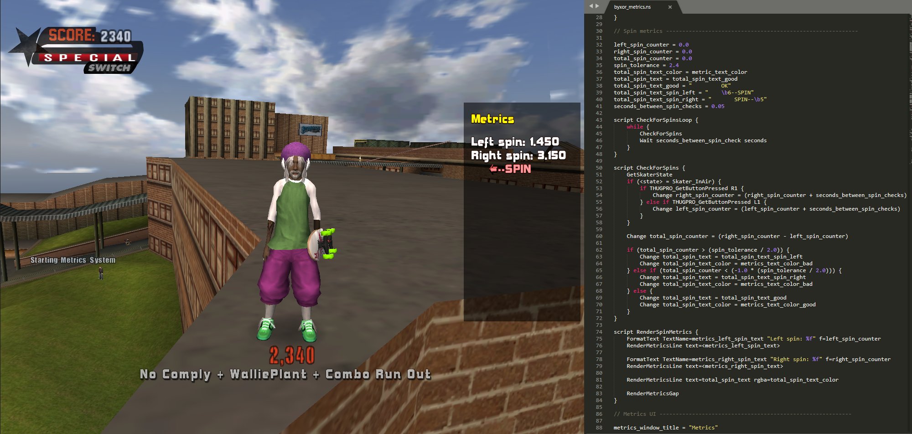

[](https://travis-ci.com/byxor/NeverScript)
[](https://codecov.io/gh/byxor/NeverScript)
[](https://goreportcard.com/report/github.com/byxor/NeverScript)



```ascii
     __                    __           _       _   
  /\ \ \_____   _____ _ __/ _\ ___ _ __(_)_ __ | |_ 
 /  \/ / _ \ \ / / _ \ '__\ \ / __| '__| | '_ \| __|
/ /\  /  __/\ V /  __/ |  _\ \ (__| |  | | |_) | |_ 
\_\ \/ \___| \_/ \___|_|  \__/\___|_|  |_| .__/ \__|
                                         |_|        
           The QB programming language.
----------------------------------------------------
```

NeverScript is a programming language that targets Neversoft's custom scripting engine (QB).

**This project contains:**

*  A `NeverScript -> QB` compiler.
*  A `QB -> NeverScript` decompiler.

**These tools are intended to work with games such as:**

*  Tony Hawk's Pro Skater 3 (THPS3)
*  Tony Hawk's Pro Skater 4 (THPS4)
*  Tony Hawk's Underground (THUG/THUG1)
*  Tony Hawk's Underground 2 (THUG2)
*  Tony Hawk's Underground Pro (THUG Pro)
*  Tony Hawk's American Wasteland (THAW)
*  Guitar Hero III (GH3)

All of these games use variations of Neversoft's scripting engine. We are primarily targetting THUG2, but we aim to create a language that is somewhat compatible with multiple games.

## Getting started

Want to try the language? We advise that you browse some documentation first.

### Where to learn NeverScript:

*  **NeverScript syntax guide:** [neverscript-syntax.ns](../docs/neverscript-syntax.ns)

### Other useful resources:

*  **Blub scripting guide by Morten:** http://www.thps-mods.com/forum/viewtopic.php?t=806
*  **Bytecode documentation by Gone:** http://thps-mods.com/forum/viewtopic.php?f=20&t=5656

## Usage

### Compiling a NeverScript file:

```bash
$ ns -c path/to/code.ns
```

This will create a new QB file: `path/to/code.qb`

### Decompiling a QB file:

```bash
$ ns -d path/to/code.qb
```

This will create a new NS file: `path/to/code.ns`

## Work in Progress

This project is a work in progress; many things are incomplete.

You can track our progress [here](https://github.com/byxor/NeverScript/projects/1).

## Special Thanks

*  **Gone, Morten, Sk8ace** - For sharing their comprehensive knowledge of the QB format.
*  **Source, Edem** - For contributing to NeverScript's development, via code and innovative ideas.
*  **Biz**, **IronHawk**, **darkdks**, **bergy** - For their encouragement.
*  **CHC**, **Skater1014** - For inspiring us with their fascinating modding projects.

If you're on this list, you've been a valuable member in making this project possible. Thank you.
