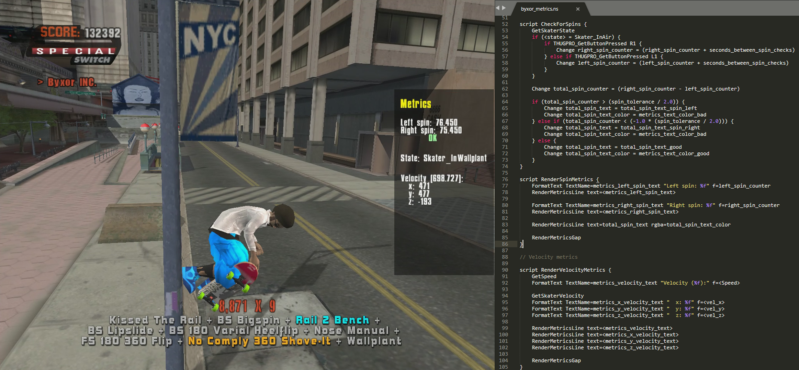

```ascii
     __                    __           _       _   
  /\ \ \_____   _____ _ __/ _\ ___ _ __(_)_ __ | |_ 
 /  \/ / _ \ \ / / _ \ '__\ \ / __| '__| | '_ \| __|
/ /\  /  __/\ V /  __/ |  _\ \ (__| |  | | |_) | |_ 
\_\ \/ \___| \_/ \___|_|  \__/\___|_|  |_| .__/ \__|
                                         |_|        
           The QB programming language.
----------------------------------------------------
```



NeverScript is a **work-in-progress** programming language that targets Neversoft's custom scripting engine (QB).

**This project contains:**

*  A `NeverScript -> QB` compiler.
*  ~A `QB -> NeverScript` decompiler~.
*  A `PRE`/`PRX` generator (QB files are usually bundled into PRE/PRX files).

**These tools are intended to work with games such as:**

*  Tony Hawk's Pro Skater 3 (THPS3)
*  Tony Hawk's Pro Skater 4 (THPS4)
*  Tony Hawk's Underground (THUG1)
*  Tony Hawk's Underground 2 (THUG2)

All of these games use variations of Neversoft's scripting engine. **Personally I've only tested against THUG2 and THPS4**, but I'm sure compatibility with other games can be improved with time.

## Getting started

*  **Download:** [latest release](https://github.com/byxor/NeverScript/releases)
*  **Syntax guide:**
    *  Best way to learn is by reading [neverscript.ns](../compiler/tests/neverscript.ns) which gets compiled by the tests.
    *  Or by reading this [outdated document](../docs/neverscript-syntax.ns).

### Other useful resources:

*  **Blub scripting guide by Morten:** http://www.thps-mods.com/forum/viewtopic.php?t=806

## Usage

### Compiling a NeverScript file:

```bash
$ ns -c path/to/code.ns
```

This will create a new QB file: `path/to/code.qb`

* Use `-o path/to/output_file.qb` to change the name of the generated file.
* Use `-showHexDump` to see the bytecode generated by the compiler.
* Use `-showDecompiledRoq` to see output from the roq decompiler (blub syntax).
* Use `-removeChecksums` to remove checksum information from the generated file.
* Use `-targetGame` followed by `thps3`/`thps4`/`thug1`/`thug2` to target a specific game.

### Decompiling a QB file:

Not implemented yet.

### Generating a PRE/PRX file:

You can generate a pre/prx file by providing a pre spec.

```bash
$ ns -p myPreSpec.ps -o bundle.pre
```

This will read the pre spec from `myPreSpec.ps` and create a new PRE file: `bundle.pre`

* Use `-showHexDump` to see the bytes of the pre file.

#### What's a pre spec?

This is a text document containing many "items".

Each "item" consists of:
1. The source path (the file to bundle).
2. The destination path (inside the pre file).

Here's an example of a pre spec containing 4 items:

```
C:\mod\build\qb\_mods\byxor_debug.qb
qb\_mods\byxor_debug.qb

C:\mod\build\qb\_mods\byxor_menu.qb
qb\_mods\byxor_menu.qb

C:\mod\build\qb\_mods\byxor_math.qb
qb\_mods\byxor_math.qb

C:\mod\qdir.txt
code\qb\qdir.txt
```

#### Note

* Only pre version 3 is supported at the moment.
* None of the items inside the pre file will be compressed.
* You can use relative paths too.

## Contributions

**The majority of pull requests probably won't be merged** unless we've spoken about it beforehand.

Having restricted ownership of this codebase gives me the freedom to make changes on a whim (which tends to happen regularly, albeit quite sparsely). Accepting contributions makes the code harder to change without coordinating with other developers.

Feel free to fork the repo and make as many changes/improvements as you like. There's no license, you don't owe me a thing.

If it's useful, I might end up asking to include it in this repo.

Feel free to submit bug reports or feature requests as issues, I appreciate the help/ideas.

## Special Thanks

*  **Gone, Morten, Sk8ace** - For sharing their comprehensive knowledge of the QB format.
*  **Source, Edem** - For contributing to NeverScript's development through code and ideas.
*  **CHC**, **Skater1014** - For working on cool things.

If you're on this list, you've been a valuable member in making this project possible. Thank you.
